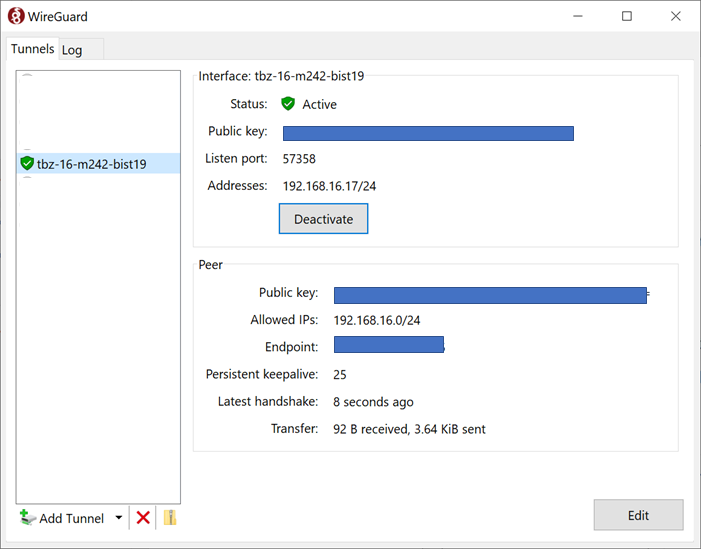

# Dokumentation vom Team PATLUCHELMUH über das Modul 300 Plattformübergreifende Service

# Inhaltsverzeichnis
* Team
* Umgebung auf der TBZ Cloud
  * VPN einrichten
* Vagrant Erklärung
  * Funktionsweise & Konzepte
  * Unsere Vagrant files
  * Erklärung vom Vagrant file
* Sicherheit
* Testing
  * Testfälle
  * Testergebnisse
* Fazit
* Reflexion
* Wissensgewinn


# Team Übersicht
  * Luca Miani 
  * Patrick Schwab 
  * Helmina
  * Ercan

# Umbebung auf TBZ Cloud einrichten und Zugriff erhalten 
Auf jedem Client muss das VPN WireGuard installiert und konfiguriert werden.

Ist die VM zugreifbar können in einem zweiten Schritt die Services, z.B. ein Web Server, mittels Portweiterleitung im Internet zur Verfügung gestellt werden.

## VPN einrichten
Das konventionelle VPN bezeichnet ein virtuelles privates (in sich geschlossenes) Kommunikationsnetz. Virtuell in dem Sinne, dass es sich nicht um eine eigene physische Verbindung handelt, sondern um ein bestehendes Kommunikationsnetz, das als Transportmedium verwendet wird. Das VPN dient dazu, Teilnehmer des bestehenden Kommunikationsnetzes an ein anderes Netz zu binden.

Installieren von [WireGuard](https://www.wireguard.com/install/) auf dem Client, dass kann ein Notebook, Raspberry Pi o.ä. sein.

In den Unterlagen zum Modul/Kurs finden Sie eine Vorlagen, z.B. wg1-template.conf und eine Liste von IP-Adressen der Server und Ihren Key und IP-Adresse für das VPN Netzwerk.

Vervollständigen Sie die Vorlage und ersetzen dabei die Einträge <replace IP> und <replace Key> durch Ihre Werte laut Liste.

Die Konfigurationsdatei sieht in etwa so aus:

```[Interface]
Address = <replace IP>/24
PrivateKey = <replace Key>

[Peer]
PublicKey = xxxxxxxxxxxxxxxxxxxxxxxxxxxxxxxx
Endpoint  = yyyyyyyyyyyyyyyyyy:518zz

AllowedIPs = 192.168.xx.0/24

# This is for if you're behind a NAT and
# want the connection to be kept alive.
# PersistentKeepalive = 25
```
Handelt es sich beim Client z.B. um einen Raspberry Pi, welcher für andere im VPN sichtbar sein soll, aktivieren Sie den Eintrag `PersistentKeepalive` bzw. kommentieren diesen aus.

**Vorsicht:** Dadurch ist die IP-Adresse und alle Ports für alle im VPN sichtbar. Sollte in Unternehmensnetzwerken nur nach Rücksprache mit dem Sicherheitsverantwortlichen aktiviert werden.

Starten Sie die WireGuard Software und fügen die ergänzte Vorlage WireGuard als Tunnel hinzu:


Und aktivieren Sie den Tunnel:



Die VMs sind nun mittels IP-Adresse inkl. allen Ports im VPN sichtbar. Zugriff auf VM mittels ssh ubuntu@X.X.X.X

# Vagrant Erklärung

Vagrant ist eine Ruby-Anwendung (open-source) zum Erstellen und Verwalten von virtuellen Maschinen (VMs).

Die Ruby-Anwendung dient als Wrapper *(engl. Verpackung, Umschlag)* zwischen Virtualisierungssoftware wie VirtualBox, VMware und Hyper-V und Software-Konfiguration-Management-Anwendungen bzw. Systemkonfigurationswerkzeugen wie Chef, Saltstack *(ist eine Open-Source-Software zur Automatisierung der Konfiguration von Serversystemen)* und Puppet *(Puppet ist ein Administrationsprogramm. Hauptanwendungsfall ist die automatisierte Konfiguration mehrerer Computer via Netzwerk.)*.

**Wichtig:** Die Virtuellen Maschinen entsprechen lauffähigen Servern.

## Funktionsweise & Konzepte

**CLI**
Vagrant wird über die Kommandozeile (CLI) bedient.

Die wichtigsten Befehle sind:

|Befehl  |Beschreibung
|--------|----------
|vagrant init|	Initialisiert im aktuellen Verzeichnis eine Vagrant-Umgebung und erstellt, falls nicht vorhanden, ein Vagrantfile
|vagrant up|	Erzeugt und Konfiguriert eine neue Virtuelle Maschine, basierend auf dem Vagrantfile                               
|vagrant ssh|	Baut eine SSH-Verbindung zur gewünschten VM auf                                                                   
|vagrant status|	Zeigt den aktuellen Status der VM an                                                                           
|vagrant port|	Zeigt die Weitergeleiteten Ports der VM an                                                                     
|vagrant halt|	Stoppt die laufende Virtuelle Maschine
|vagrant destroy|	Stoppt die Virtuelle Maschine und zerstört sie.

Weitere Befehle sind unter: [Vagrant.com](https://www.vagrantup.com/docs/cli/)

## Unsere Vagrant files

Bis jetzt haben wir das 

``` 
vagrant init ubuntu/trusty64
sudo apt-get update
sudo apt install apache2
vagrant up
```

## Erklärung vom Vagrant file

Initialisiert im aktuellen Verzeichnis eine Vagrant-Umgebung und erstellt, falls nicht vorhanden, ein Vagrantfile.
```
vagrant init ubuntu/trusty64
```

Die Ubuntu VM laded die neusten Updates runter und installiert diese.
```
sudo apt-get update
```

Der neuste Apache2 Dienst wird runtergeladen und installiert. 
```
sudo apt install apache2
```

Erzeugt und Konfiguriert eine neue Virtuelle Maschine, basierend auf dem Vagrantfile.
```
vagrant up
```

# Sicherheit

## UFW Firewall

UFW steht für Uncomplicated Firewall. Ziel von UFW ist es, ein unkompliziertes Kommandozeilen-basiertes Frontend für das sehr leistungsfähige, aber nicht gerade einfach zu konfigurierende iptables zu bieten. UFW unterstützt sowohl IPv4 als auch IPv6.

#### Ausgabe der offenen Ports
```
    $ netstat -tulpen
 ```
#### Installation
```
    $ sudo apt-get install ufw
```
#### Start / Stop
```
    $ sudo ufw status
    $ sudo ufw enable
    $ sudo ufw disable
```
#### Firewall-Regeln
```
    # Port 80 (HTTP) öffnen für alle
    vagrant ssh web
    sudo ufw allow 80/tcp
    exit
    # Port 22 (SSH) nur für den Host (wo die VM laufen) öffnen
    vagrant ssh web
    w
    sudo ufw allow from [Meine-IP] to any port 22
    exit
    # Port 3306 (MySQL) nur für den web Server öffnen
    vagrant ssh database
    sudo ufw allow from [IP der Web-VM] to any port 3306
    exit
```
#### Zugriff testen
```
    $ curl -f 192.168.55.101
    $ curl -f 192.168.55.100:3306
```
#### Löschen von Regeln
```
    $ sudo ufw status numbered
    $ sudo ufw delete 1
```
### Ausgehende Verbindungen
Ausgehende Verbindungen werden standardmässig erlaubt.

Werden keine Ausgehenden Verbindungen benötigt oder nur bestimmte (z.B. ssh) können zuerst alle geschlossen und dann einzelne Freigeschaltet werden.
```
    $ sudo ufw deny out to any
    $ sudo ufw allow out 22/tcp 
```
## Reverse Proxy
#### Der Apache-Webserver kann auch als Reverse Proxy eingerichtet werden.

***Installation*** Dazu müssen folgende Module installiert werden:
```
    $ sudo apt-get install libapache2-mod-proxy-html --> ist schon im apache2-bin enthalten
    $ sudo apt-get install libxml2-dev
 ```
#### Anschliessend die Module in Apache aktivieren:

```
    $ sudo a2enmod proxy
    $ sudo a2enmod proxy_html
    $ sudo a2enmod proxy_http 
```
#### Die Datei /etc/apache2/apache2.conf wie folgt ergänzen:
```
    ServerName localhost 
```
#### Apache-Webserver neu starten:
```
    $ sudo service apache2 restart
```
#### Konfiguration
#### Die Weiterleitungen sind z.B. in `sites-enabled/001-reverseproxy.conf` eingetragen:

```
    # Allgemeine Proxy Einstellungen
    ProxyRequests Off
    <Proxy *>
        Order deny,allow
        Allow from all
    </Proxy>
    # Weiterleitungen master
    ProxyPass /master http://master
    ProxyPassReverse /master http://master
```

# Testing
Um unsere Vagrant files auch veröffentlichen wollen müssen wir sie zu erst testen. Dafür haben wir Testfälle erstellt und diese auch durchgeführt.

## Testfälle

* Die Vagrant files wurden durchgeführt und die VM wurde mit dem richtigen Namen erzeugt?
* DIe VM's wurden gestartet und die richtigen Dienste laufen?

## Testergebnisse

# Fazit

Mit Vagrant files können VM's schnell Aufgebaut werden so wie auch ganze Netzwerk Umgebungen. Duch Vagrant files können vor konfigurierte VM's und ganze Umgebungen einfach weitergegeben werden. 

# Reflexion

# Wissensgewinn

