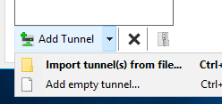

# Dokumentation vom Team PATLUCHELMUH über das Modul 300 Plattformübergreifende Service

# Einleitung
In diesem Dokument beschreiben wir unsere Arbeitsschritte von dem Einrichten der Umgebung, Erstellung der eigenen Lernumgebung, arbeiten mit Vagrant bis hin zur Implementation der Sicherheitsaspekte. 

# Inhaltsverzeichnis
* Team
* Umgebung auf der TBZ Cloud
  * VPN einrichten
* Vagrant Erklärung
  * Funktionsweise & Konzepte
  * Unsere Vagrant files
  * Erklärung vom Vagrant file
* Sicherheit
* Testing
  * Testfälle
  * Testergebnisse
* Fazit
* Reflexion
* Wissensgewinn


# Team Übersicht
  * Luca Miani
  * Patrick Schwab
  * Helmina Jusufi
  * Muhammed Ercan


## Umgebung auf TBZ Cloud einrichten und Zugriff erhalten

Wir haben zur Einrichtung unserer Toolumgebung zuerst alle einen GitHub-Account eingerichtet. Dieser Account verwenden wir als Cloud-Speicher für unsere Dokumentation und alle anderen Dateien. Wir haben den Zugriff über die TBZ-Cloud gemacht. Auf jedem Client muss das VPN WireGuard installiert und konfiguriert werden. Da die Bereitstellung virtueller Systeme normalerweise lange dauert und auch umständlich sein kann, arbeiten wir mit Vagrant. Vagrant ist eine Anwendung, welche zur Erstellung und Verwaltung virtueller Maschinen dient und eine einfache Softwareverteilung ermöglicht. Mit Vagrant kann man eine VM schneller und unkomplizierter erstellen. (Man könnte auch eine virtuelle Maschine mit VirtualBox einrichten. Nach dem Installieren der VirtualBox kann man gemäss Angaben der Dokumentation die virtuelle Maschine erstellen. Dies dauert aber etwas länger und ist umständlicher.) Nachdem wir das Ganze eingerichtet haben, haben wir uns noch Visual Studio Code als Unterstützung geholt. Dies trägt zum effizienteren Arbeiten bei, da man alle lokalen Repositories an einem Ort verwalten kann und da auch die dazugehörigen Dateien bearbeiten kann.


Ist die VM zugreifbar können in einem zweiten Schritt die Services, z.B. ein Web Server, mittels Portweiterleitung im Internet zur Verfügung gestellt werden.

## VPN einrichten
Das konventionelle VPN bezeichnet ein virtuelles privates (in sich geschlossenes) Kommunikationsnetz. Virtuell in dem Sinne, dass es sich nicht um eine eigene physische Verbindung handelt, sondern um ein bestehendes Kommunikationsnetz, das als Transportmedium verwendet wird. Das VPN dient dazu, Teilnehmer des bestehenden Kommunikationsnetzes an ein anderes Netz zu binden.

Installieren von [WireGuard](https://www.wireguard.com/install/) auf dem Client, dass kann ein Notebook, Raspberry Pi o.ä. sein.

In den Unterlagen zum Modul/Kurs finden Sie eine Vorlagen, z.B. wg1-template.conf und eine Liste von IP-Adressen der Server und Ihren Key und IP-Adresse für das VPN Netzwerk.

Vervollständigen Sie die Vorlage und ersetzen dabei die Einträge <replace IP> und <replace Key> durch Ihre Werte laut Liste.

Die Konfigurationsdatei sieht in etwa so aus:

```[Interface]
Address = <replace IP>/24
PrivateKey = <replace Key>

[Peer]
PublicKey = xxxxxxxxxxxxxxxxxxxxxxxxxxxxxxxx
Endpoint  = yyyyyyyyyyyyyyyyyy:518zz

AllowedIPs = 192.168.xx.0/24

# This is for if you're behind a NAT and
# want the connection to be kept alive.
# PersistentKeepalive = 25
```
Handelt es sich beim Client z.B. um einen Raspberry Pi, welcher für andere im VPN sichtbar sein soll, aktivieren Sie den Eintrag `PersistentKeepalive` bzw. kommentieren diesen aus.

**Vorsicht:** Dadurch ist die IP-Adresse und alle Ports für alle im VPN sichtbar. Sollte in Unternehmensnetzwerken nur nach Rücksprache mit dem Sicherheitsverantwortlichen aktiviert werden.

Starten Sie die WireGuard Software und fügen die ergänzte Vorlage WireGuard als Tunnel hinzu:



Und aktivieren Sie den Tunnel:


Die VMs sind nun mittels IP-Adresse inkl. allen Ports im VPN sichtbar. Zugriff auf VM mittels ssh ubuntu@X.X.X.X

# Vagrant Erklärung

Vagrant ist eine Ruby-Anwendung (open-source) zum Erstellen und Verwalten von virtuellen Maschinen (VMs).

Die Ruby-Anwendung dient als Wrapper *(engl. Verpackung, Umschlag)* zwischen Virtualisierungssoftware wie VirtualBox, VMware und Hyper-V und Software-Konfiguration-Management-Anwendungen bzw. Systemkonfigurationswerkzeugen wie Chef, Saltstack *(ist eine Open-Source-Software zur Automatisierung der Konfiguration von Serversystemen)* und Puppet *(Puppet ist ein Administrationsprogramm. Hauptanwendungsfall ist die automatisierte Konfiguration mehrerer Computer via Netzwerk.)*.

**Wichtig:** Die Virtuellen Maschinen entsprechen lauffähigen Servern.

## Funktionsweise & Konzepte

**CLI**
Vagrant wird über die Kommandozeile (CLI) bedient.

Die wichtigsten Befehle sind:

|Befehl  |Beschreibung
|--------|----------
|vagrant init|	Initialisiert im aktuellen Verzeichnis eine Vagrant-Umgebung und erstellt, falls nicht vorhanden, ein Vagrantfile
|vagrant up|	Erzeugt und Konfiguriert eine neue Virtuelle Maschine, basierend auf dem Vagrantfile                               
|vagrant ssh|	Baut eine SSH-Verbindung zur gewünschten VM auf                                                                   
|vagrant status|	Zeigt den aktuellen Status der VM an                                                                           
|vagrant port|	Zeigt die Weitergeleiteten Ports der VM an                                                                     
|vagrant halt|	Stoppt die laufende Virtuelle Maschine
|vagrant destroy|	Stoppt die Virtuelle Maschine und zerstört sie.

Weitere Befehle sind unter: [Vagrant.com](https://www.vagrantup.com/docs/cli/)

## Unsere Vagrant files

Bis jetzt haben wir das

```
vagrant init ubuntu/trusty64
sudo apt-get update
sudo apt install apache2
vagrant up
```

## Erklärung vom Vagrant file

Initialisiert im aktuellen Verzeichnis eine Vagrant-Umgebung und erstellt, falls nicht vorhanden, ein Vagrantfile.
```
vagrant init ubuntu/trusty64
```

Die Ubuntu VM laded die neusten Updates runter und installiert diese.
```
sudo apt-get update
```

Der neuste Apache2 Dienst wird runtergeladen und installiert.
```
sudo apt install apache2
```

Erzeugt und Konfiguriert eine neue Virtuelle Maschine, basierend auf dem Vagrantfile.
```
vagrant up
```

# Sicherheit

## UFW Firewall

UFW steht für Uncomplicated Firewall. Ziel von UFW ist es, ein unkompliziertes Kommandozeilen-basiertes Frontend für das sehr leistungsfähige, aber nicht gerade einfach zu konfigurierende iptables zu bieten. UFW unterstützt sowohl IPv4 als auch IPv6.

Ausgabe der offenen Ports
```
    $ netstat -tulpen
 ```
Installation
```
    $ sudo apt-get install ufw
```
Start / Stop
```
    $ sudo ufw status
    $ sudo ufw enable
    $ sudo ufw disable
```
Firewall-Regeln
```
    # Port 80 (HTTP) öffnen für alle
    vagrant ssh web
    sudo ufw allow 80/tcp
    exit
```
```
    # Port 22 (SSH) nur für den Host (wo die VM laufen) öffnen
    vagrant ssh web
    w
    sudo ufw allow from [Meine-IP] to any port 22
    exit
```
```
    # Port 3306 (MySQL) nur für den web Server öffnen
    vagrant ssh database
    sudo ufw allow from [IP der Web-VM] to any port 3306
    exit
```
Zugriff testen
```
    $ curl -f 192.168.55.101
    $ curl -f 192.168.55.100:3306
```
Löschen von Regeln
```
    $ sudo ufw status numbered
    $ sudo ufw delete 1
```
Ausgehende Verbindungen
Ausgehende Verbindungen werden standardmässig erlaubt.

Werden keine Ausgehenden Verbindungen benötigt oder nur bestimmte (z.B. ssh) können zuerst alle geschlossen und dann einzelne Freigeschaltet werden.
```
    $ sudo ufw deny out to any
    $ sudo ufw allow out 22/tcp
```
Reverse Proxy
Der Apache-Webserver kann auch als Reverse Proxy eingerichtet werden.

Installation Dazu müssen folgende Module installiert werden:
```
    $ sudo apt-get install libapache2-mod-proxy-html --> ist schon im apache2-bin enthalten
    $ sudo apt-get install libxml2-dev
 ```
Anschliessend die Module in Apache aktivieren:

```
    $ sudo a2enmod proxy
    $ sudo a2enmod proxy_html
    $ sudo a2enmod proxy_http
```
Die Datei /etc/apache2/apache2.conf wie folgt ergänzen:
```
    ServerName localhost
```
Apache-Webserver neu starten:
```
    $ sudo service apache2 restart
```
Konfiguration
Die Weiterleitungen sind z.B. in sites-enabled/001-reverseproxy.conf eingetragen:

    # Allgemeine Proxy Einstellungen
```
    ProxyRequests Off
    <Proxy *>
        Order deny,allow
        Allow from all
    </Proxy>
```
    # Weiterleitungen master
    ProxyPass /master http://master
    ProxyPassReverse /master http://master

## Absichern der einzelnen VMs
## Verstecken von Servern und Services
## Sichere Kommunikation via SSH

# Testing
Tests dienen ganz einfach dazu verschiedene Dinge zu testen, bevor man das getestete verwendet. So kann man Fehler und Grenzen schon im Vorhinein finden und bei Bedarf verbessern. Jeglicher Test muss genau festgehalten werden und er muss von einer anderen Person replizierbar sein, ansonsten ist das Ergebnis des Tests wertlos.

Um unsere Vagrant files auch veröffentlichen wollen müssen wir sie zu erst testen. Dafür haben wir Testfälle erstellt und diese auch durchgeführt.


## Testfälle

| Die zu testende Aktion                                     | Erwartete Ausgabe/Aktion                                      | Tatsächliche Ausgabe/Aktion                     | 
| -----------------------                                    | -------------------------                                     |----------------------------                     |
| Im Browser auf 10.1.31.8 verbinden                         | Die Seite erscheint.                                          | Die Seite erscheint beim Aufruf.                |
| Im Browser auf 10.1.31.8:8080 verbinden                    | Apache2 Ubuntu Default Page öffnet sich.                      |Apache2 Ubuntu Default Page öffnet sich.         |
| Im Browser auf 10.1.31.8:8080/master verbinden             | /master: Apache2 Ubuntu Default Page öffnet sich              |/master: Apache2 Ubuntu Default Page öffnet sich |
| Die Vagrant files wurden durchgeführt?                     | Wahr                                                          | Wahr                                            |
| VM wurde mit dem richtigen Namen erzeugt?                  | Wahr                                                          | Wahr                                            |
| DIe VM's wurden gestartet und die richtigen Dienste laufen?| Wahr                                                          | Wahr                                            |

## Testergebnisse

# Fazit

Mit Vagrant files können VM's schnell Aufgebaut werden so wie auch ganze Netzwerk Umgebungen. Duch Vagrant files können vor konfigurierte VM's und ganze Umgebungen einfach weitergegeben werden.

# Reflexion

## Reflexion Muhammed Ercan
Schon am ersten Tag, war es für mich interessant in diesem Modul. Das Projekt hatte mir Spass gemacht, auch wenn es eher kürzer ausgefallen ist, als wie gewohnt. Innerhalb dieses Projektes war es möglich vieles zu lernen. Diese Chance habe ich genützt, um mich mit meinem Team stetig auszutauschen. Auch zum ersten Mal habe ich mit der TBZ Cloud gearbeitet. Das hat mir gefallen, weil ich das Gefühl hatte, dass es viel schneller ist. Das Arbeiten an der Fach Hochschule gefiel mir sehr. Die Lehrperson war immer wieder bei Fragen erreichbar. Somit war es für mich eine gute Mischung aus Inputs vom Lehrer und dem Selbst Orientierten Lernen. Ich freue mich auf die weiteren Module.

## Reflexion Helmina Jusufi
### Arbeit
In diesem Modul habe ich sehr viel neues kennengelernt. Beim Einrichten der Umgebung habe ich gesehen, was es für verschiedene Möglichkeiten gibt. Ich habe gelernt was VirtualBox ist, ich habe GitHub kennengelernt, zudem habe ich mich bei der Umsetzung mit Vagrant auseinandergesetzt, welches ich vorher auch noch nicht kannte. Der Lehrer war für Fragen immer offen und konnte mir auch sehr gut helfen. 
### Zusammenarbeit
Die Zusammenarbeit im Team war ausgezeichnet. Wir haben uns alle zuerst eingelesen und alle Fragen im Team geklärt. Danach haben wir uns die Aufgaben aufgeteilt und haben uns alle an die Aufteilung der Aufgaben gehalten. Dies hat uns die Arbeit am Projekt sehr erleichtert. Wir konnten alle sehr gut miteinander umgehen. Da Muhammed Ercan, Luca Miani und ich bereits oft miteinander Projekte geführt haben und bei Schulaufträgen gemeinsam in einer Gruppe waren, fiel uns die Zusammenarbeit noch leichter. Somit sind wir sehr schnell zum Ziel gekommen und hatten keine Probleme bei der Umsetzung.

## Reflexion Luca Miani
Obwohl ich schon ein wenig Vorwissen hatte, konnte ich in diesem Modul sehr viel neues lernen. Ich habe Vagrant sehr gut kennengelernt und kann nun gut damit umgehen. Da ich schon oft mit Linux gearbeitet habe und es sehr gerne mache, hat mir diese LB sehr Spass gemacht. Bei Problemen habe ich mich beim Lehrer oder bei meinen Teamkollegen gewendet. Die Zusammenarbeit mit Muhammed Ercan, Helmina Jusufi und Patrick Schwab war sehr gut. Wir sind gut miteinander ausgekommen, haben uns gegenseitig unterstützt und unsere Arbeiten zeitgerecht fertiggestellt. Was ich auch sehr gut fand war, dass wir mit Github gearbeitet haben und so alle jederzeit ganz einfach Zugriff darauf hatten.

## Reflexion Patrick Schwab
Ich habe für die Zukunft gelernt, dass die Vagrant Files einen grossen Wert haben. Ausserdem weiss ich nun, dass ich im Team mehr Spass am Lernen habe als allein und es nicht darauf ankommt, ob ich mit meinen Freunden in einer Gruppe bin oder mit anderen Mitschülern, die ich weniger gut kenne. Dazu kommt, dass ich viele neue Funktionen kennenlernen durfte im Bezug auf Virtuelle Maschinen, Systemsicherheit und Vagrant Files. Das Arbeiten mit Github hat mir ausserdem auch Spass gemacht, weil man alles für jeden verfügbar hat.

# Wissensstand und Gewinn der Teammitglieder

## Luca Miani

Ich arbeite ab und zu im Geschäft mit Linux. Ausserdem habe ich Zuhause mehrere Linux Server. Daher behaupte ich, dass ich sicherlich Kenntnisse habe mit Linux. Einen eigenen Github Acount hatte ich schon vor diesem Modul. Jedoch hatte ich am Anfang dieses Moduls auch keine Erfahrungen mit Vagrant. Dies lernte ich jedoch im Laufe dieses Projektes kennen. Dazu lies ich verschiedene Beiträge und machte mich schlau auf Github. Ausserdem konnte ich bei Fragen immer wieder mein Team fragen, welches mir auch weiterhilf. Das Arbeiten auf der TBZ Cloud fand ich sehr angenehm.  Ich konnte ausserdem einiges lernen im Bereich Systemsicherheit. In das Thema SSH habe ich mich ein wenig vertieft und konnte somit auch dies so im Projekt einsetzen.

## Muhammed Ercan

Im Geschäft arbeite ich mehrheitlich mit Macs. Weil Mac OS und Linux sehr ähnlich sind, hatte ich schon einige Erfahrungen mit Linux. Ausserdem habe ich mehrere Server mit Linux aufgesetzt und diese betrieben. Des weiteren habe ich noch einige Services drauf lauffen lassen. Jedoch hatte ich noch vor dem Modul keinen Github Account. Daher schaute ich am Anfang einige Blogs zu Github. Daher kamen mit der Zeit Kentnisse auch über Mark Down und Github. Ich habe zusammen mit Helmina Jusufi im Modul Systemsicherheit gearbeitet. Daher hatten wir von diesem Modul auch Erfahrungen mit der Sicherheit eines Systems. Zu den verschiedenen Vagrant Files habe ich nicht viel gewusst, daher konnte ich auch einiges zu den Vagrant-Files dazulernen. Ausserdem hat mir das Arbeiten auf TBZ Cloud gefallen.

## Patrick Schwab


Mit den Themen Linux, Github, Mark Down oder der Versionsverwaltung hatte ich schon zuvor Kentnisse. Ich arbeite privat mit den genannten Themen. Jedoch muss ich sagen, dass ich über eine längere Zeit hinweg nicht mehr auf Github war. Daher habe ich einige coole Funnktionen schon vergessen. Wobei mit der Zeit auf Github dies wieder aufkam. Ich habe viel über Container gelernt und selbst gesehen welche Vorteile dies gegen den normalen VM hat. Ich finde Git macht in vielen Anwendungsbereichen viel Sinn und werde versuchen, dies in Zukunft mehr zu gebrauchen. Was mir auch gefallen hat, ist das Arbeiten mit diesem Team. Jeder hatte jeden respektiert und wir haben alle gut arbeiten können.


## Helmina Jusufi

Auch Ich habe einige Male in der Schule mit Linux gearbeitet. Zudem haben wir Testserver im Geschäft die ich selber aufsetzen durfte und auf denen ich einiges ausprobieren konnte, somit bin ich vertraut mit einigen Befehlen. Für die Systemsicherheit interssiere ich mich sehr, daher habe ich in diesem Modul viel dazulernen können. Ich kannte Github vorher noch nicht. Ich habe nur davon gehört und in diesem Modul habe ich mich zum ersten Mal richtig damit auseinandergesetzt. Auch von Vagrant habe ich zum ersten Mal gehört und konnte auch dazu neues lernen. Die Unterlagen, welche uns zur Verfügung stehen, haben mir geholfen mich schnell in dieses Modul einzulesen und gleich loszulegen. Das Arbeiten auf der TBZ Cloud empfand ich ebenfalls wie meine Teammitglieder als angenehm.
